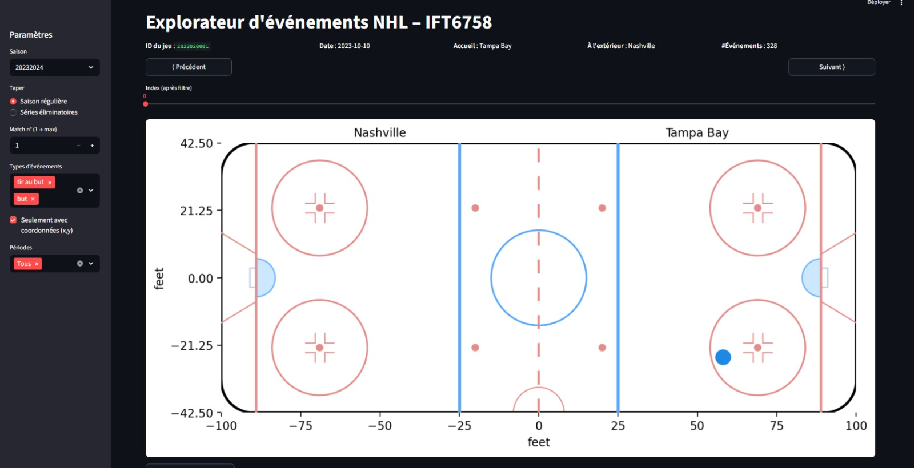
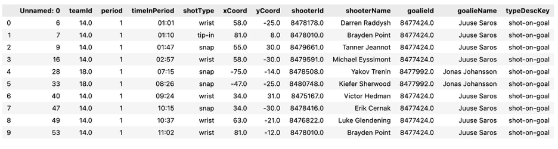
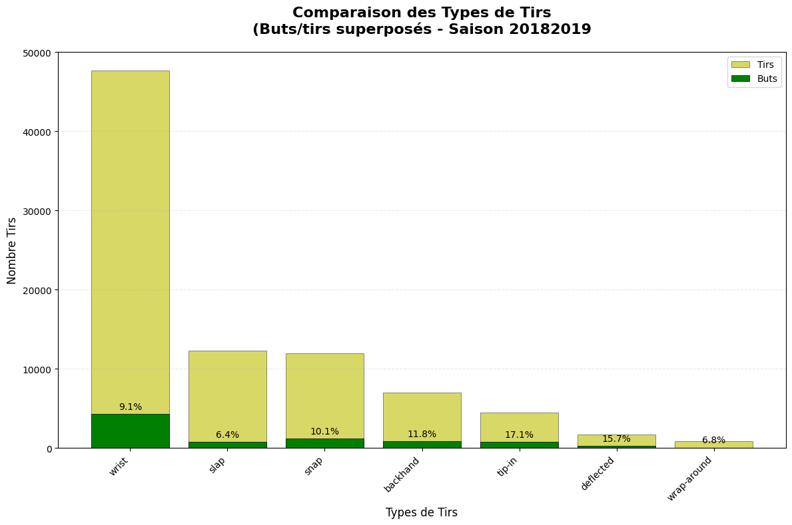
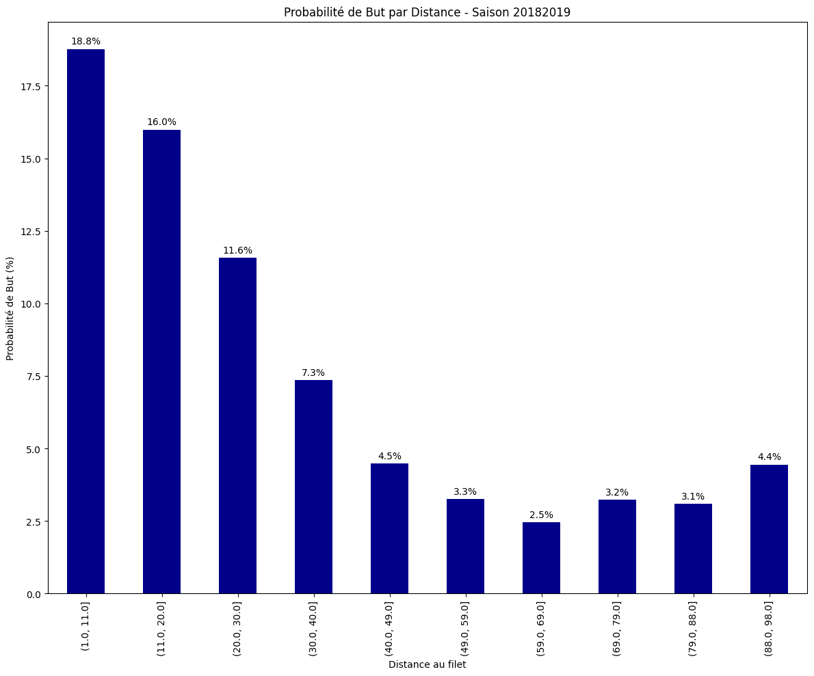
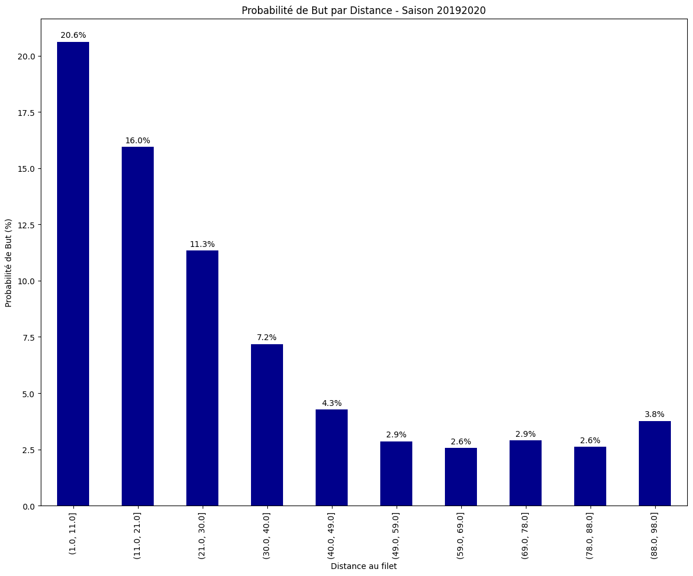
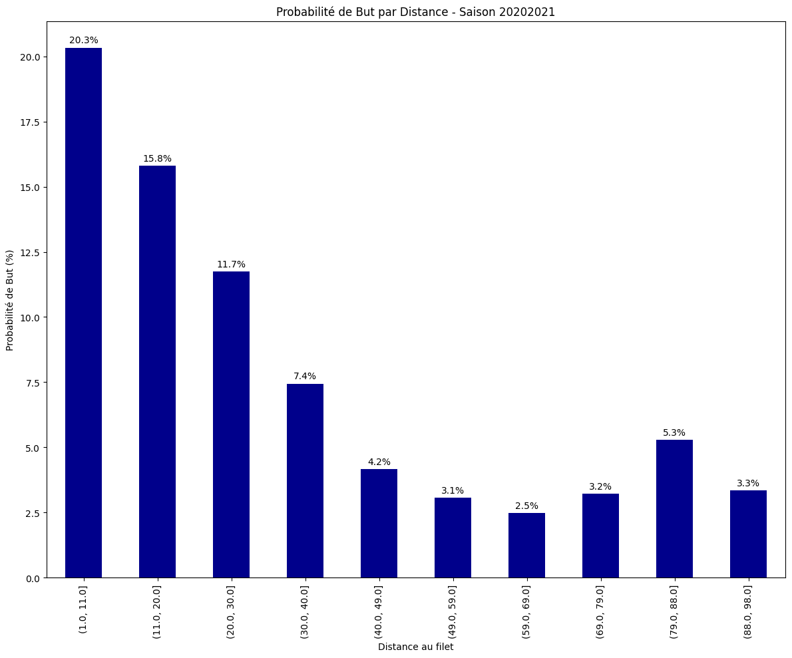
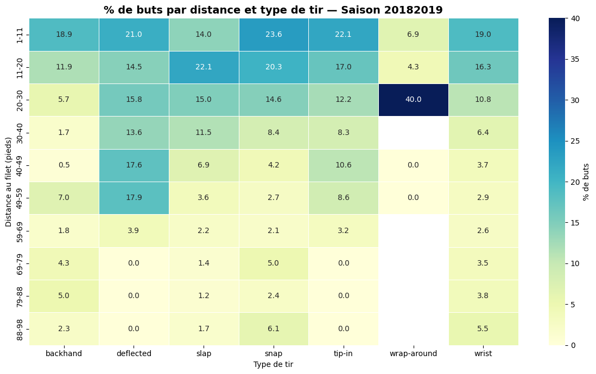
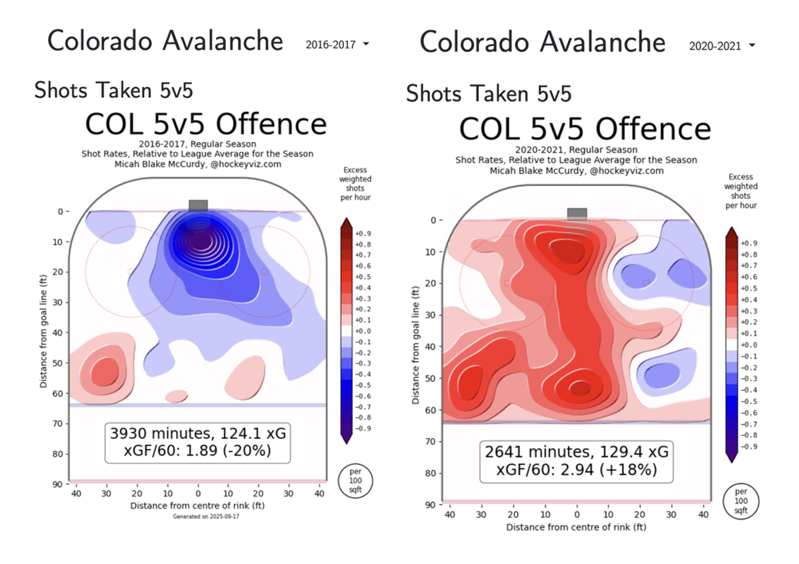
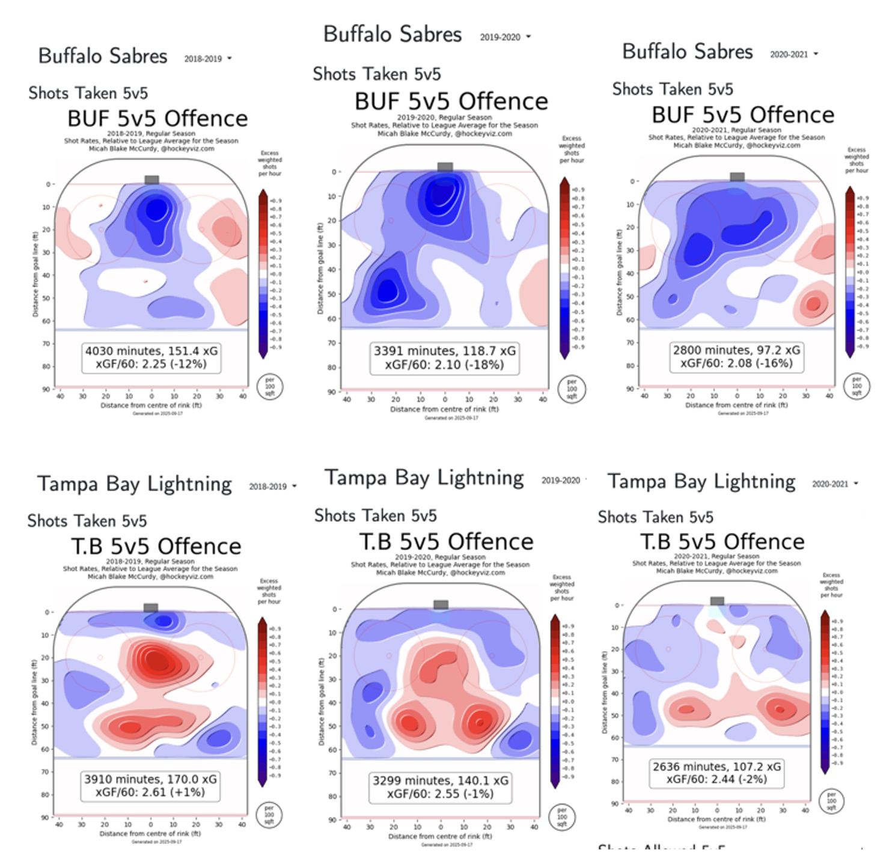

<mark> limite de mots? </mark>
<mark> formatting particulier requis? </mark> <br>

<mark> 
consignes: Pour soumettre votre projet, vous devez:
Publier votre soumission étape finale à la branche master ou main
(Vous devez le faire avant de télécharger les ZIPs!)
Soumettez un fichier ZIP de votre blog à gradescope
Soumettez un fichier ZIP de votre base de code à gradescope
Ajoutez le compte IFT6758 TA Github (@ift-6758-a25) à votre repo en tant que viewer </mark>
<br>
<br>

# Question 1: Acquisition des données
<mark> Niveau de détails qu'il faut? On a expliqué ici chaque méthode de la classe </mark>

## Initialisation 
Pour télécharger des données du site de la **Ligue nationale de hockey (LNH)**, nous créons une classe nommée `LNHDataScrapper`.  
Lors de son initialisation, elle vérifie si le répertoire `./ressources/` existe déjà ; sinon, elle le crée automatiquement pour y sauvegarder les fichiers téléchargés.
<br>

## Télécharger les données d’un match
Pour charger et visualiser les données d’un **match unique**, nous utilisons la méthode `get_one_game`.  
Elle envoie une requête au lien suivant pour récupérer le fichier JSON correspondant depuis les serveurs de la LNH :

https://api-web.nhle.com/v1/gamecenter/{GAME_ID}/play-by-play

Le paramètre **`{GAME_ID}`** identifie le match à télécharger (ex:`2023020001`)

- Les 4 premiers chiffres réfèrent à la **saison du match** (ex: `2023` pour la saison 2023-2024).  
- Les 2 chiffres suivants indiquent le **type de match** :  
  - `01` = pré-saison  
  - `02` = saison régulière  
  - `03` = séries éliminatoires (_playoffs_)  
  - `04` = match des étoiles  
- Les 4 derniers chiffres identifient le **numéro précis du match** (allant de `0001` à `1353`).

On peut aussi préciser si l’on souhaite sauvegarder le fichier localement, grâce à l’argument `save=True`.  
<br>

## Génération des étiquettes des séries éliminatoires
Les étiquettes identifiant les matchs des **séries éliminatoires (_playoffs_)** ont un format particulier.
Elles sont générées automatiquement par la méthode `generate_playoff_game_ids`, qui concatène plusieurs éléments :
- `SEASON_START_YEAR` : l’année de début de la saison (ex. 2018 pour la saison 2018-2019)
- `GAME_TYPE` : la valeur 03 désignant les _playoffs_
- `ROUND` : numéro de la ronde (de 1 à 4)
- `MATCHUP` : numéro de la série à l’intérieur de la ronde (8 séries en ronde 1, 4 en ronde 2, 2 en ronde 3 et 1 en finale)
- `GAME` : numéro du match dans la série (de 1 à 7 possibles)

La méthode utilise des boucles itératives pour générer toutes les combinaisons possibles de ces paramètres.
Par exemple, pour la saison 2018-2019, elle produit des étiquettes allant de 2018030111 (ronde 1, série 1, match 1) à 201803047 (ronde 4, finale, match 7).
<br>

## Téléchargement d'une saison complète
Pour télécharger une **liste complète de matchs** d’une saison, on utilise la méthode `get_season_data`.
On y précise la saison à récupérer (par exemple : "20232024").

La méthode appelle successivement `get_one_game` pour chaque match de la saison régulière, puis pour toutes les étiquettes possibles des séries éliminatoires générées par `generate_playoff_game_ids`.
Les données sont sauvegardées dans une liste Python, puis enregistrées dans un fichier JSON. 
<br>

## Charger les données sauvegardées
Pour accéder rapidement aux données d’une saison déjà téléchargée, on utilise `open_data` :
- Si le fichier JSON de la saison existe déjà, il est chargé directement.
- Sinon, la méthode appelle automatiquement `get_season_data` pour le créer avant de le charger.
<br>

## Gestion des erreurs
Lors du téléchargement, certains matchs peuvent ne pas exister (par exemple, si la saison n’est pas terminée ou si certaines séries éliminatoires se sont arrêtées avant sept matchs).
Ces erreurs sont capturées par une exception personnalisée : `DownloadException`.
Elle permet au programme de continuer ou d’interrompre le téléchargement de façon contrôlée selon le contexte :
- arrêt après le dernier match de saison régulière,
- poursuite pendant les _playoffs_.
<br>

## Exemple d’utilisation <mark>À valider avec équipe</mark>
Le code suivant télécharge les données complètes de la saison 2023-2024:
```python
scrapper = LNHDataScrapper()
season_data = scrapper.open_data("20232024")
```

Le contenu est ensuite sauvegardé dans :
`./ressources/20232024.json`
et chargé dans la variable `season_data`, une liste de dictionnaires représentant les données JSON de chaque match.
<br>
<br>
<br>
<br>

# Question 2: Outil de débogage interactif — “Explorateur d’événements NHL”


**Ce que fait l’outil**
Cet explorateur charge les événements (tirs au but, buts, etc.) jeu par jeu depuis vos fichiers et les projette sur une patinoire à l’échelle NHL. Il *réoriente automatiquement les coordonnées* selon le côté attaqué/défendu et affiche les points d’événements par période. C’est idéal pour *vérifier la qualité et l’orientation des données* avant d’agréger (ex. cartes de tir).

**Comment l’utiliser**

1.⁠ ⁠`Saison` : choisissez une saison (ex. 20232024). <br>
2.⁠ ⁠`Type` : Saison régulière ou Séries éliminatoires. <br>
3.⁠ ⁠`Match⁠ n°⁠` : parcourez les matchs avec les flèches *Précédent/Suivant*. <br>
4.⁠ ⁠⁠`Types d’événements⁠` : cochez tir au but, but (ou autres si disponibles). <br>
5.⁠ ⁠⁠`Coordonnées (x,y)⁠` : laissez l’option activée pour ne garder que les événements géolocalisés. <br>
6.⁠ ⁠⁠`Périodes⁠` : filtrez par période (1/2/3/OT) si besoin. <br>
7.⁠ ⁠⁠`Lecture⁠` : les points s’affichent *sur la patinoire*, correctement orientés; zoomez/panoramique pour inspecter, et servez-vous de la légende/infobulles (si activées dans votre version) pour voir les détails. <br>
<br>

⁠Utilisation typique : vérifier que les tirs d’une équipe se concentrent bien *dans la zone offensive à droite* après normalisation, repérer des *valeurs aberrantes (x négatif, points hors patinoire)*, ou valider que les *lignes bleues/ligne rouge* correspondent aux repères attendus pour vos cartes de tir.

<br>
<br>
<br>
<br>

# Question 3: Nettoyage des données
Nous avons transformé les fichiers JSON en dataframe Pandas pour ne retenir que les informations par rapport aux tirs et aux buts. Voici un aperçu de notre dataframe :
<br>


<mark>À ajouter: le rapport de force au moment du but: <br>
par exemple dans le dictionnaire: {"eventId":87,"periodDescriptor":{"number":1,"periodType":"REG","maxRegulationPeriods":3},<br> 

"timeInPeriod":"09:40","timeRemaining":"10:20",**"situationCode":"1451"**,"homeTeamDefendingSide":"right","typeCode":505,<br>

"typeDescKey":**"goal"**,"sortOrder":175,"details":{"xCoord":93,"yCoord":-5,"zoneCode":"O","shotType":"wrap-around",<br>"scoringPlayerId":8470595,"scoringPlayerTotal":2,"assist1PlayerId":8482113,"assist1PlayerTotal":7,"eventOwnerTeamId":13,<br>"goalieInNetId":8478499,"awayScore":1,"homeScore":0,"discreteClip":6335751717112}}, <br>
voir site web suivant pour interpréter les codes: https://gitlab.com/dword4/nhlapi/-/issues/112
</mark>
<br>
<mark> dans le df, colonne "unnamed" =? </mark>
<br>

Il est intéressant de connaître le **rapport de « force »** aux moments des tirs, c’est-à-dire le rapport de joueurs de l’équipe offensive versus l’équipe défensive sur la patinoire à chaque tir. Cela nous indique si le joueur offensif a tiré dans une situation d’**avantage** ou d’**infériorité numérique**, ce qui pourrait potentiellement influencer sa performance. Cependant, dans notre dataframe, cette information n’est directement disponible que pour les **buts (_goal_)**. Afin de connaître le rapport de force pour les tirs qui n’ont **pas mené à un but (_shot on goal_)**, il faudrait retravailler le dataframe en quelques étapes :
-	D’abord, comme le retrait d’un joueur est effectué à cause des **pénalités**, nous devons extraire tous les événements de pénalité
-	Pour chacun de ces pénalités, récupérer :
    - L’identifiant de l’équipe pénalisée (`teamId`)
    - Le temps de début (`timeInPeriod`) et la durée (`details['duration']`) pour calculer l’intervalle de pénalité
-	Extraire les événements de tirs sans but (_shot on goal_)
-	Pour chacun de ces tirs, récupérer:
    - L’identifiant d’équipe du tireur (`teamId`)
    - Le temps du tir (`timeInPeriod`).
-	Calculer le rapport de force au moment de chaque tir :
    - Pour chaque tir, vérifier quelles **pénalités sont actives** à ce moment (s’il y a un chevauchement entre le `timeInPeriod` du tir et de l’intervalle de pénalité)
    - Déduire le nombre de joueurs sur glace pour chaque équipe (généralement **5 - nombre de pénalités actives**). 
    - Stocker le **nombre effectif de joueurs par équipe** pour chaque tir afin d’obtenir le rapport de force (5v4, 5v3, etc.).
<br>

Par ailleurs, d’autres informations intéressantes sont dérivables des données du dataframe actuel :
-	D’abord, nous pouvons identifier les **tirs en rebond**. Ceux-ci se produisent après qu’un tir initial ait été intercepté et redirigé par le gardien, et qu’un joueur de la même équipe récupère la rondelle pour réessayer immédiatement un autre tir au but. Pour ce faire, nous devons :
    - Extraire tous les tirs n’ayant pas mené aux buts ainsi que ceux qui ont mené à un but (_shots on goal_ et _goals_)
    - Trier ces tirs par leur moment d’exécution (`timeInPeriod`)
    - Identifier les tirs effectués dans un intervalle de temps très court après un _shot on goal_, par exemple 5 à 10 secondes après.
    - Valider que le même gardien a tenté d’intercepter les deux tirs 
-	Ensuite, nous pouvons déterminer les **tirs en contre-attaque**. Ceux-ci sont effectués par une équipe qui récupère la rondelle lorsque l’équipe adverse est en mode attaque, et qui se projette rapidement vers le filet adverse pour tirer. Pour cela, il faut :
    - Extraire tous les tirs de type _shots on goal_ et _goals_, ainsi que les événements de récupération (`giveaway`, `missed shot`, `blocked shot`, `takeaway`)
    - Trier ces événements par leur moment d’exécution (`timeInPeriod`)
    - Identifier les tirs effectués dans un intervalle de temps très court après un événement de récupération (par exemple, 10 secondes)
    - Valider que la même équipe a réalisé la récupération et le tir 
-	Nous pouvons aussi calculer les **distances et les angles de tir** par rapport au filet à l’aide des coordonnées x et y de chaque tir et du filet. Nous pourrions alors rechercher une corrélation potentielle entre la difficulté du tir (distances et angles), avec son taux de réussite pour marquer un but. 
-	Finalement, nous pouvons évaluer la présence ou l’absence de **joueurs assistants (_assist_)** pour chaque tir, et corréler la variable avec la réussite du tir. 
<br>
<br>
<br>
<br>

# Question 4: Visualisations simples

## Visualisation des types de tirs
Voici un graphique comparant les types de tirs de toutes les équipes de la saison 2018-2019. 
<br>


<br>

Ce graphique de barres empilées (tirs en jaune + buts en vert) montre simultanément le volume par type et la part des buts (les buts sont un sous-ensemble des tirs totaux). Cela permet d’identifier :
- le type le plus fréquent (hauteur totale).
- le type le plus dangereux (proportion de vert par rapport au jaune, indiquée en pourcentage dans chaque barre).
Le type de tir _tip-in_ semble le plus **dangereux** avec 17.1% de conversion en but. Le type de tir _wrist_ est de loin le type le plus **courant** avec un nombre total approchant 50 000.  
<br>

## Relation entre la distance de tir et la probabilité de marquer un but 
**Approche pour créer les graphiques:**
- Calcul de la distance de chaque tir au filet (distance euclicienne)
- Division des distances en intervalles égaux (bins) pour calculer les probabilités comparables
 - Calcul de la probabilité de but pour chaque intervalle : $$\frac{\text{buts}}{\text{tirs totaux}} \times 100$$
 - Affichage du graphique en barres montrant la probabilité par intervalle de distance 
<br>




<br>

Les graphiques des 3 saisons ci-dessus démontrent une **relation décroissante entre la distance du tir par rapport au but et sa probabilité de réussite**. On observe une probabilité entre 16 à 20% de scorer un but si le tir est entre 3 à 12 pieds du filet (zone dangereuse au hockey appelée « l’enclave »), comparée à 7 à 10% entre 21 et 39 pieds du filet. À plus que 60 pieds du filet, les tirs ont une très mince chance de réussite (0 à 3%). Ceci est logique, vu qu’un tir plus proche du gardien lui donne moins de temps pour réagir, offre une meilleure visibilité du filet à l’attaquant. <mark> La minime tendance à la hausse des probabilités de scorer un but à une distance encore plus loin du filet (>70 pieds) représente probablement des variations bruitées et non significatives. </mark> Cette relation est **congruente à travers le 3 saisons de 2018 à 2021**. 
<br>

## Proportion de buts par tirs en fonction de la distance au filet et du type de tirs


Voici un **graphique _heatmap_** illustrant la **proportion de buts (# buts / # tirs) en fonction de la distance au filet et du type de tirs**, pour la saison 2018-2019. Ce type de graphique représente aisément les deux dimensions à visualiser (distance × type) et permet la comparaison de chaque type de tir à distance égale. Le gradient de couleur démontre bien la hiérarchie de dangerosité de chaque combinaison de distance et de type de tir.
Encore une fois, on peut voir que la **probabilité de scorer un but est hautement reliée à la proximité au filet**. Tous les types de tirs atteignent les plus hauts taux de réussite à <20 pieds du filet. À plus de 40-50 pieds du filet, les chances de réussite chutent de moitié ou plus pour presque les types de types. Les tirs ayant les plus grands taux de réussite à proximité sont les _tip in_ (concordant avec notre premier graphique) et _snap_. Les données des tirs _wrap around_ sont les seules à ne pas suivre cette tendance, probablement à cause du petit nombre de tirs et donc d’un résultat bruité. 
<br>
<br>
<br>
<br>

# Question 5: Visualisations avancées
Avec les données sur l’ensemble des tirs, nous avons généré des plans de tirs offensifs pour quelques équipes et saisons:
<br>

<mark>Insérer les 4 graphiques de zones offensives (mais lesquelles?) <br>
On a 8 graphiques: Avalanche 2016-2017, Avalanche 2020-2021, Sabres 2018-2019, 2019-2020, 2020-2021 <br>
et Lightning 2018-2019, 2019-2020, 2020-2021. 
</mark>
<br>

À chaque coordonnée de la patinoire, nous avons calculé la **différence du taux de tirs par heure de chaque équipe** comparée au **taux de tirs moyen de la ligue**. Les régions rouges représentent des endroits où l’équipe en question a tiré plus que la moyenne de la ligue, les régions bleues, moins que la moyenne, et les régions blanches, égale à la moyenne. 
<br>

À partir de ces graphiques, nous pouvons dériver plusieurs points intéressants sur la performance des équipes :
-	En combinant le **taux des tirs** par rapport à la moyenne avec le **classement de l’équipe**, on peut estimer **l’efficacité de leurs tirs**. Une équipe qui tire plus mais qui est moins bien classée produit des tirs probablement moins efficaces, ou fait face à un gardien plus performant. 
-	Une autre façon d’évaluer l’efficacité des tirs est de voir leur **position par rapport au filet**. En général, les tirs originant de **l’enclave** (zone entre les deux cercles de mise en jeu et directement devant le filet adverse) sont plus dangereux. Si une équipe tire plus que la moyenne dans l’enclave, elle a tendance à être plus efficace. 
-	On peut évaluer le **style offensif** de l’équipe. Si la majorité de tirs sont réalisés à partir de l’enclave, l’équipe attaque de façon directe et efficace. Si les tirs sont plus dispersés, l’équipe implique aussi les joueurs en périphérie. En visualisant les graphiques de plusieurs saisons, on peut voir des **changements de stratégies** de jeu selon les nouveaux joueurs ou entraîneurs qui se joignent à l’équipe.  
-	Si on superpose aussi les **positions des joueurs** les plus fréquemment placés aux « zones chaudes » de tirs durant la saison, on peut deviner **quels joueurs ont contribué le plus aux tirs**.
<br>

Comme exemple, comparons les saisons 2016-2017 et 2020-2021 de **l’Avalanche du Colorado**:
<br>


<br>

<mark>Insérer les 2 graphiques de l'Avalanche </mark>
<br>

En **2016-2017**, l’équipe a tiré **moins que la moyenne** de la ligue à la majorité des endroits de la zone offensive, incluant la zone directement devant le filet. Le seul emplacement où l’équipe a généré plus de tirs était loin du filet, sans autres « zones chaudes » de tirs sur la patinoire potentiellement signe d’une stratégie offensive dispersée. Ceci indique une **équipe moins performante**, et reflète bien le **classement à la 30ième position** de la LNH durant cette saison. Pour contraster, en **2020-2021**, l’équipe a tiré **plus que la moyenne** à la majorité de la zone offensive. Beaucoup de tirs ont été effectués directement devant le filet, mais également plus loin du filet. Ceci indique une équipe probablement **plus agressive et dynamique** impliquant les joueurs offensifs à diverses positions, et globalement **plus performante (classée 1ère de la division de l'Ouest)**!  
<br>

Comparons maintenant les graphiques des **Sabres de Buffalo** et les **Lightning de Tampa Bay** durant les saisons de **2018-2019**, **2019-2020** et **2020-2021**. 


<mark>Insérer graphiques de Sabres et Lightning </mark>
<br>

Les **Sabres** tirent **moins que la moyenne dans l’enclave et en général**. Les zones générant des tirs plus nombreux que la moyenne sont loin du filet ou à des angles difficiles : des tirs probablement **peu efficaces**. Cela corrèle avec leurs classements à la 6ième position sur 8 dans la division de l’Atlantique et à la 13ième position sur 16 dans la Conférence de l’Est. En contraste, les **Lightning** tirent **plus que la moyenne** sur une grande région de la zone offensive, **surtout dans l’enclave** et les régions devant le filet. Leurs tirs sont donc probablement **plus dangereux**, expliquant leur classement à la 1ère, 2e et 3e de leur division et de leur conférence durant ces années (quoique la performance a décliné un peu en 2021).
<br>

Il est cependant à noter que ces plans de tirs seuls ne peuvent **pas expliquer entièrement la performance** d’une équipe. Notamment, les tirs réussis versus non-réussis et les **types de tir** (« _slapshot_ », « _wrist shot_ », « _backhand_ », etc., qui sont chacun associé à un taux de réussite différent) n’y sont pas démontrés. On ne connaît pas non plus **l’identité du tireur**, la **vitesse** d’un tir, le **temps écoulé entre une passe et le tir**, le **contexte défensif** et position des adversaires, le **rapport de force** au moment du tir, le **lieu du match** (ville native de l'équipe ou non), la **dynamique de l’équipe** lors de la saison… tous des facteurs importants dans la performance d’une équipe.  


